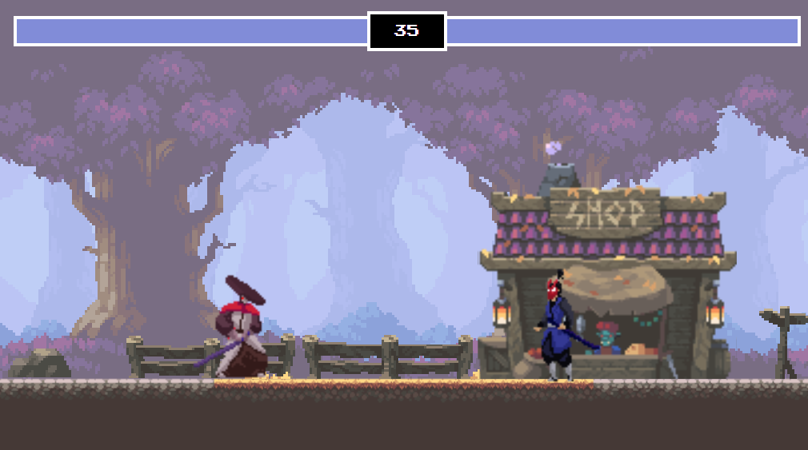

# FIGHTING GAME


<p align="center">
    
</p>

## Usage

In order to play the game properly you need a keyboard to move the characters, Just Click on the Live Demo Link and enjoy 

[**Live Demo**](https://mohaned-fighting-game.netlify.app/)

## Table of Contents

* [Instructions](#instructions)
* [Downlaod](#download)
* [Rules](#rules)

## Instructions

This is a JavaScript Practicing Project By using javascript latest features and oop classes to build the game.

## Download

You can easily download it and play it by just click on the download button and choose download .zip file, then you have to extract it, then open the index.html file and start playing. You can also clone it by following the steps below: 

1. Clone Project:
    ```
        $ git clone https://github.com/Mohaned-Adel/fighting-game.git
    ```
2. open it:
    open it with your code editor or open the index.html file.

3. enjoy it: 
    Start Hacking or just play and enjoy it.


## Rules

The rules are simple, you have two characters (player and enemy), Player can move Right (D) Left (A) and jump (W) also can hit using (Space bar). The enemy character can move Right (RightArrow), Left (LeftArrow), Jump (TopArrow) and hit using (BottomArrow).
The winner who can be live until the end :)
Have a nice game.